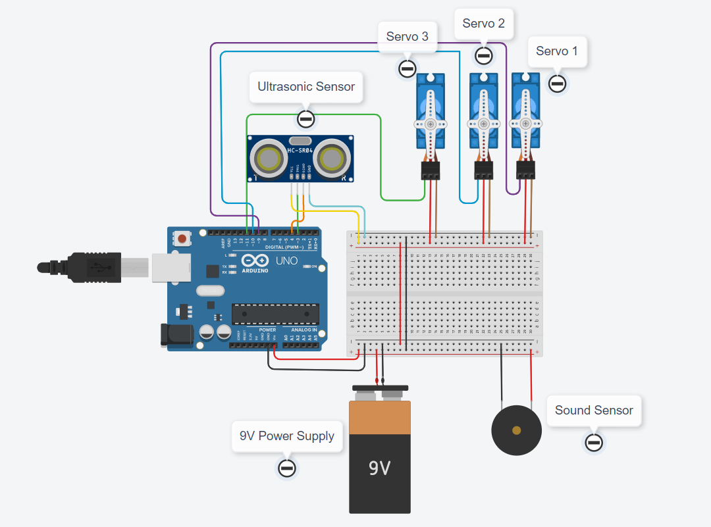

# snake-robot
> The program implements three servo motors to move a continuum robot snake purposed for search and rescue operations. The system includes a digital PID controller for closed-loop autonmous control. The circuit includes two calibrated sensors (ultrasonic and a microphone module) to provide inputs to the system. The sensors will collect information on the environment such as the distance from the target and the noise made by the target. The logic applied to this system is structured into 3 conditions (i) robot senses the target larger than the set range? (ii) robot senses the target within range and is sound detected and (iii) robot senses the target that is less than the set range. The autnomous nature of the robot intends for the robot to move towards the target and detect them using an external python radar.

## Table of contents
* [General info](#general-info)
* [Technologies](#technologies)
* [Design Schematic](#design-schematic)
* [Circuit Setup](#circuit-setup)
* [Status](#status)
* [Contact](#contact)

## General info
The purpose of this project is to implement an autonomous continuum robot using a digital PID algorithm with the Atmega328 uController

## Technologies
* ArduinoIDE- version 1.8.13
* Arduino PID Library- version 1.2.0 - by [Brett Beauregard ](https://github.com/br3ttb/Arduino-PID-Library)
* Radar Emulator - by [Makers Portal](https://makersportal.com/blog/2020/3/26/arduino-raspberry-pi-radar)

## Design Schematic

> Schematic for Slider Crank Mechanism

## Circuit Setup

> Wiring Diagram

## Status
Project is: _finished_

## Contact
Created by [@akansha-n888](https://www.linkedin.com/in/akansha-nagar/) - feel free to contact me or others on my team!
